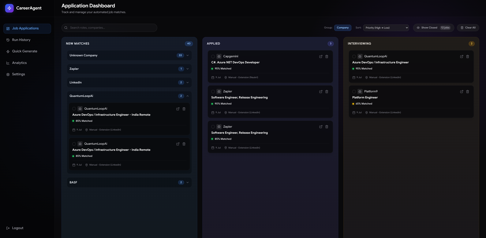
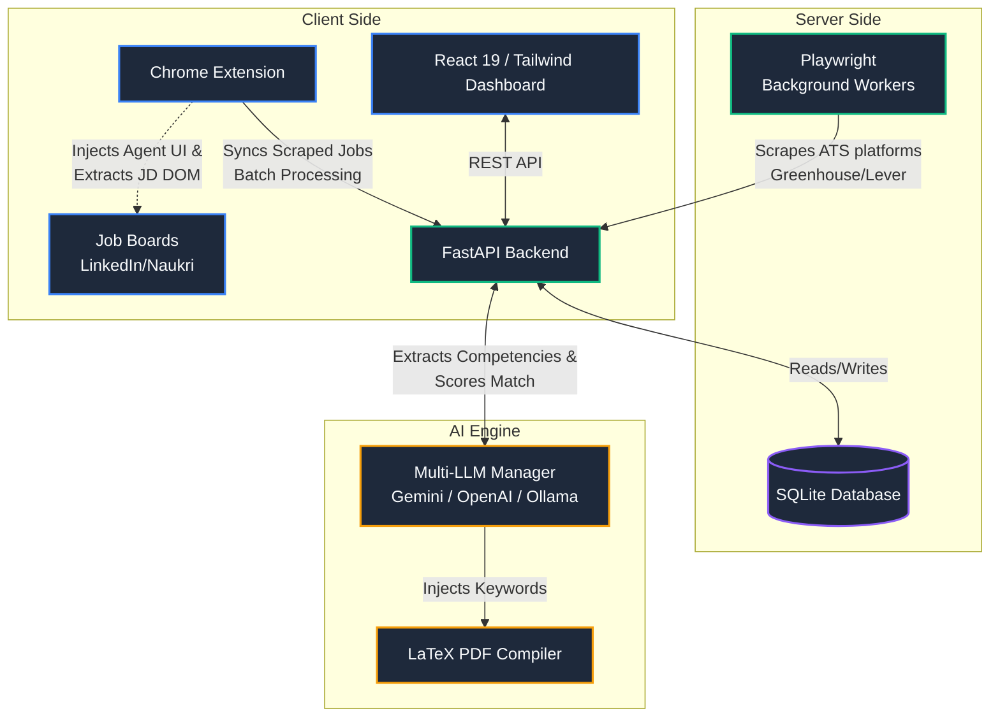

<div align="center">
  
  
  # CareerAgent
  
  **Your personal AI-powered job search automation platform.**  
  Quietly scrape job boards, evaluate match scores, and programmatically compile ATS-friendly LaTeX resumes and cold emails.

  [](https://github.com/hariharavk/career-agent/stargazers)
  [](https://github.com/hariharavk/career-agent/network/members)
  [](https://opensource.org/licenses/MIT)
  [](https://react.dev/)
  [](https://fastapi.tiangolo.com/)
  [](https://www.docker.com/)

  <p align="center">
    <a href="#-why-careeragent">Why CareerAgent?</a> •
    <a href="#-features">Features</a> •
    <a href="#-architecture">Architecture</a> •
    <a href="#-getting-started">Installation</a> •
    <a href="#-contributing">Contributing</a>
  </p>

</div>

---

**CareerAgent** is a sophisticated, 100% free automation platform built for ambitious software engineers and IT professionals. It replaces the exhausting manual job hunt with an intelligent engine that scrapes target companies, evaluates your precise fit using your choice of AI, and compiles professionally formatted LaTeX PDFs designed to bypass corporate Applicant Tracking Systems.

<div align="center">
  
  <p><em>Track your job applications in a beautiful, dynamic Kanban pipeline.</em></p>
</div>

---

## 🚀 Why CareerAgent?

Unlike generic AI job wrappers that spam "Easy Apply" buttons, **CareerAgent focuses on quality and precision.** It acts as your personal career agent, ensuring your resume mathematically aligns with the raw Job Description and generating personalized outreach materials that recruiters actually read.
## ✨ Features

- **Automated Job Discovery**: A powerful hybrid approach. Uses Playwright backend scrapers for standard ATS platforms, and a companion Chrome Extension to directly scrape heavily protected sites (LinkedIn, Indeed) completely bypassing IP bans.
- **Kanban Pipeline**: Organize your job search visually. Drag and drop jobs across columns (New, Applied, Interviewing, Rejected) to track your pipeline at a glance.
- **AI Match Scoring**: Instantly evaluates your exact profile against the raw job description, providing a definitive 0-100 match score.
- **1-Click Application Materials**: Dynamically injects missing keywords into your base resume and natively compiles a pristine ATS-friendly PDF using LaTeX. Also generates tailored cover letters and cold emails.
- **Bring Your Own Keys**: Bring your own OpenAI/Anthropic keys, or use Google AI Studio for 100% free AI processing. Natively manages API rate limits. For complete privacy, it supports executing fully locally via **Ollama**.
## 🏗 Architecture

CareerAgent uses an elegant, decoupled microservice architecture:



## 🚀 Getting Started

### Method 1: Docker (Recommended)
The easiest way to run CareerAgent is using our pre-built GitHub Container Registry (GHCR) images. You don't need to install Node or Python!

```bash
# 1. Download the docker-compose file
curl -O https://raw.githubusercontent.com/hariharavk/career-agent/main/docker-compose.yml

# 2. Start the application in the background
docker compose up -d
```
*Visit `http://localhost:5173` to access the dashboard. Your database and files will be safely stored in the local directory via Docker volumes.*

---

### Method 2: Manual Installation (For Developers)

#### Prerequisites
- Node.js (v20+)
- Python (3.11+)
- `pdflatex` (TexLive / MiKTeX) for resume compilation

#### Setup & Run
```bash
# 1. Setup Python Backend
python3 -m venv venv
source venv/bin/activate
pip install -r requirements.txt

# 2. Setup Node Frontend
cd frontend
npm install
cd ..

# 3. Run the full application (Frontend + Backend APIs)
./start.sh
```

## 🤝 Contributing
We welcome contributions from the community! Check out our [Contributing Guide](CONTRIBUTING.md) to get started. See what we're working on in the [Roadmap](ROADMAP.md).

## 📄 License
This project is open-source under the [MIT License](https://opensource.org/licenses/MIT).
